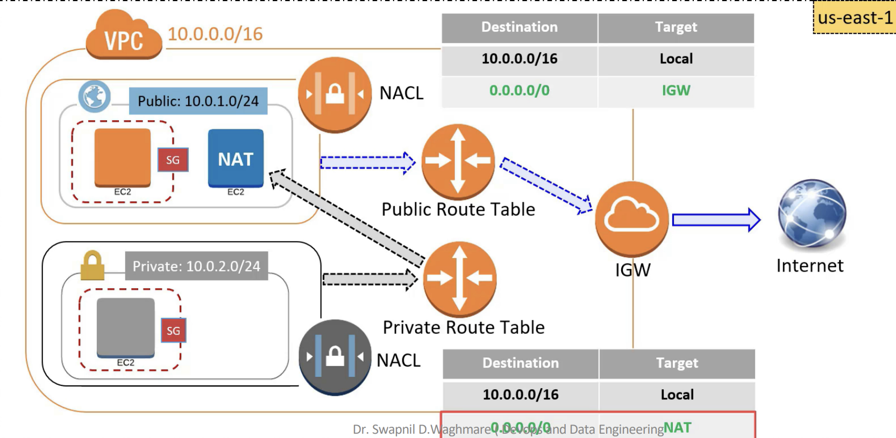
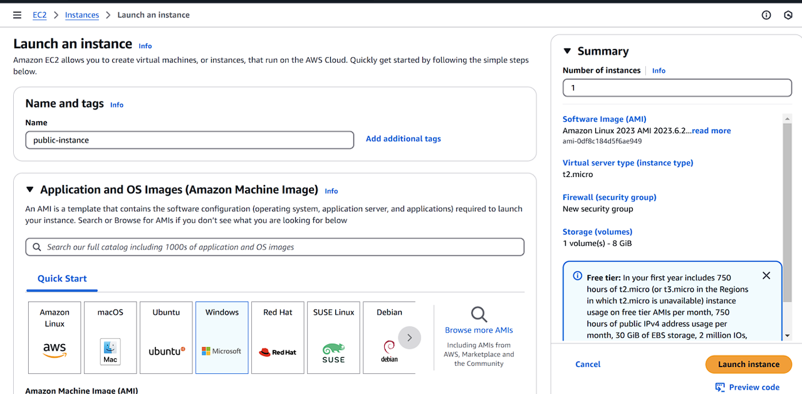
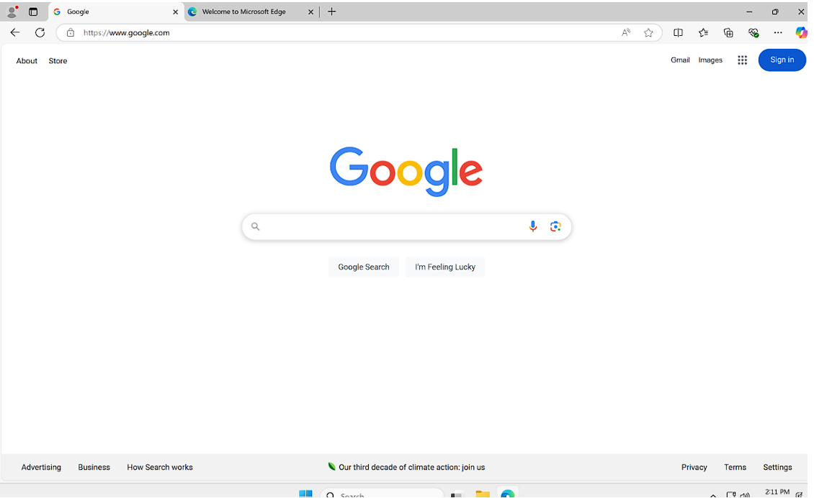

# Dual-Subnet-Architecture-on-AWS

---

##  Objective

To build a **dual-subnet architecture** on AWS that enables **secure communication** between public and private EC2 instances using a **NAT Gateway**. The project provides hands-on experience with VPC configuration, networking components, and testing connectivity.

---

## Architecture

---

##  Technologies Used

- **Amazon VPC**
- **Public and Private Subnets**
- **Internet Gateway (IGW)**
- **NAT Gateway**
- **Network ACLs**
- **Route Tables**
- **EC2 Instances (Windows)**

---

##  Implementation Steps

### 1. Create a VPC
- Created a custom VPC with CIDR block: `10.0.0.0/16`.
.png)

### 2. Create an Internet Gateway (IGW)
- Created and attached an Internet Gateway to the VPC.
.png)

### 3. Create Subnets
- **Public Subnet**: `10.0.1.0/24`
- **Private Subnet**: `10.0.2.0/24`
.png)

### 4. Create Network ACL (NACL)
- Created a NACL allowing all inbound and outbound traffic.
- Associated it with both public and private subnets.
.png)

### 5. Create Route Tables
- Created two route tables:
  - **Public Route Table**: Routes `0.0.0.0/0` to IGW.
  - **Private Route Table**: Initially has no route to internet.
.png)

### 6. Launch EC2 Instances
- Launched one EC2 instance in **Public Subnet** with internet access (RDP enabled).
- Launched another EC2 instance in **Private Subnet** without auto-assign public IP.

### 7. Test Internet Access
- Verified internet access is available only in the public instance.

- Confirmed private instance had no internet.

### 8. Create and Configure NAT Gateway
- Created a NAT Gateway in the public subnet with an Elastic IP.

- Updated private route table to forward `0.0.0.0/0` traffic through the NAT Gateway.
- Verified the private instance could access the internet via the public instance.

---

##  Result

Successfully deployed a dual-subnet architecture where:
- **Public instance** can directly access the internet.
- **Private instance** can access the internet through the **NAT Gateway** only.

